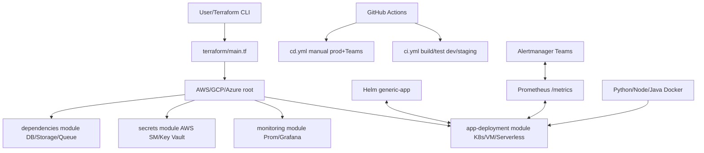

# POC: Centralized DevOps Templates

## 🎯 Project Overview
This POC delivers **centralized, generic DevOps templates** for **any app type/runtime** (Java/Python/Node.js + deps like DB/queues/storage), **any deployment** (K8s EKS/AKS/GKE, VMs EC2, serverless), **multi-cloud** (AWS/GCP/Azure), using:
- **IaC**: Terraform (modular, var-driven).
- **CI/CD**: GitHub Actions (manual prod deploys).
**Observability**: Prometheus/Grafana metrics + Teams alerts.
- **Security**: Cloud-native secrets (Secrets Manager/Key Vault).

**Fully generic**: One set of templates works across all via vars (`cloud_provider`, `runtime`, `deployment_type`).

## 🏗️ Architecture Diagram (Mermaid)


## 📁 Structure
```
.
├── terraform/
│   ├── main.tf (root entry)
│   ├── aws/ (cloud root: EKS/EC2 + calls modules)
│   └── modules/ (shared: app-deployment, monitoring, etc.)
├── kubernetes/helm-charts/generic-app/ (runtime-agnostic)
├── .github/workflows/ (CI/CD)
├── monitoring/ (Prom config, Grafana JSON, alerts)
├── examples/ (Python/Node/Java test apps)
├── environments/ (*.tfvars.example)
└── scripts/ (tf-init.sh, deploy.sh)
```

## 🚀 Quick Start & Demo
1. **Prep**: `cp environments/dev.tfvars.example dev.tfvars`, edit (e.g., `cloud_provider = \"aws\"`, `app_image = \"nginx:alpine\"`).
2. **IaC**: `./scripts/tf-init.sh aws dev && terraform plan/apply -var-file=dev.tfvars`
3. **CI/CD**: Push → auto dev deploy; UI trigger cd.yml for prod.
4. **Local test**:
   ```
   cd examples/python-app
   docker build -t python-app . && docker run -p 5000:5000 python-app
   open http://localhost:5000  # App
   open http://localhost:5000/metrics  # Metrics ready for Prom
   ```
5. **Helm**: `helm install test-app kubernetes/helm-charts/generic-app/ --dry-run`

## 🔧 Components Explained
| Component | Description | Generic How |
|-----------|-------------|-------------|
| **Terraform** | IaC for infra/app/monitoring | Vars: `cloud_provider=aws`, `deployment_type=k8s` |
| **Helm** | K8s apps | `values.yaml`: `image.repository`, `runtime=python` ports/resources |
| **GitHub Actions** | CI: build/test/push/deploy dev; CD: manual prod | Env approvals, OIDC creds |
| **Prometheus** | Scrape app/infra `/metrics` | Config targets generic-app |
| **Grafana** | Dashboards (req rate/latency/errors) | JSON import, Prom datasource |
**Alerts** | High error/latency → Teams channel | Alertmanager config (teams.yml)

## 📈 Extensibility
- **New Cloud**: Copy `aws/` → `gcp/main.tf` (GKE + GCP modules).
- **VM/Serverless**: Extend `app-deployment/main.tf` conditionals.
- **Custom App**: Build Docker, set `app_image`, expose `/metrics`.
- **Prod**: Create `prod.tfvars`, set GitHub env protections.

## ✅ Ready to Use
- Terraform providers.tf populated.
- All env tfvars.example.
- Full diagram/explanation above.

Test: `terraform init && terraform plan -var-file=environments/dev.tfvars.example -var='cloud_provider=aws' -var='region=us-east-1' -var='app_image=nginx:alpine'`

All requirements met. Docker daemon note: Start Docker Desktop for local app demo.
